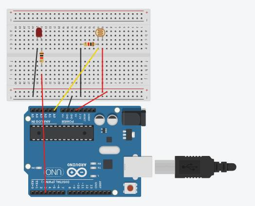

# 💡 Controle de Iluminação Inteligente com LDR

## 🚀 Visão Geral
> Este projeto utiliza um Arduino, um LDR (Resistor Dependente de Luz) e um LED para criar um sistema de detecção de escuridão simples. O LED acende automaticamente quando a luz ambiente cai abaixo de um limite predefinido, simulando um sensor de luz noturno.

## ⚙️ Funcionamento
> 1. O LDR está configurado em um divisor de tensão para medir a intensidade da luz ambiente.
> 2. O Arduino lê o valor analógico do LDR ($$ de 0 a 1023$$) e o converte para Volts ($$ de 0 a 5V$$).
> 3. Quando a tensão lida está baixa (indicando que a resistência do LDR está alta, ou seja, está escuro), o LED é ativado (acende).

> A conversão de Volts é feita pela fórmula: $$V_{\text{LDR}} = \left(\frac{\text{Leitura Analógica}}{1023}\right) \times 5$$

## 🛠️ Hardware Necessário
* Placa Arduino (Uno/Nano)
* 1x LDR
* 1x LED (qualquer cor)
* 1x Resistor de $10k\Omega$ (para o divisor de tensão)
* 1x Resistor de $220\Omega$ (para o LED)
* Protoboard e Jumpers

## 🔌 Conexões (Esquema de Circuito)

## ✅ Resultado Final 

https://github.com/user-attachments/assets/8f740279-3bad-4fd0-8589-9d792362f899

